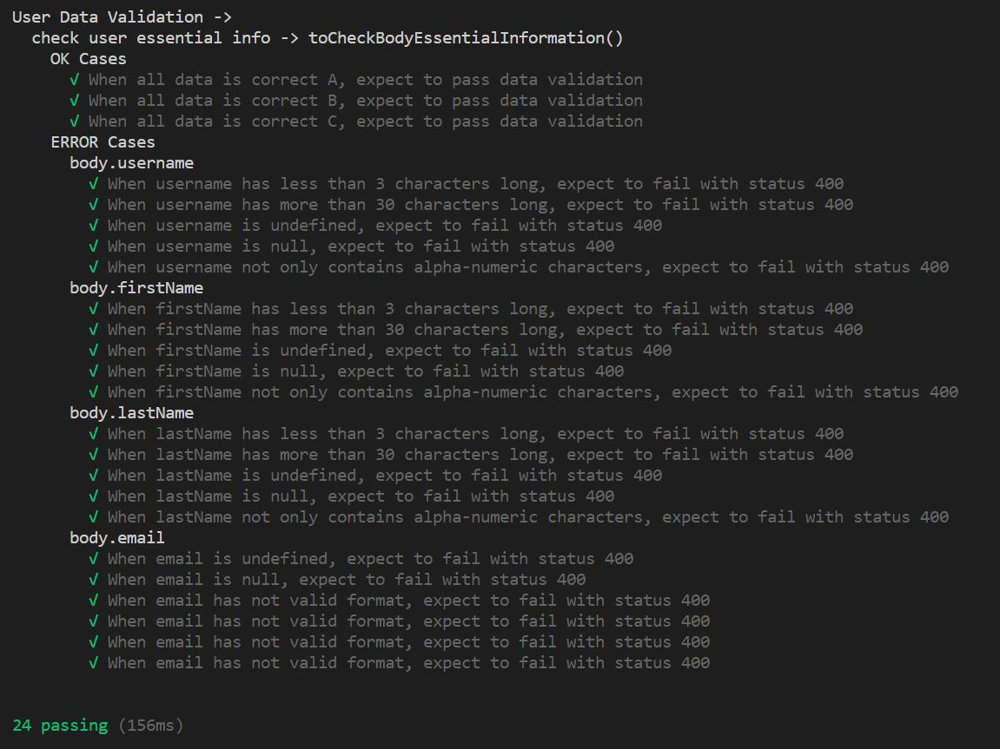
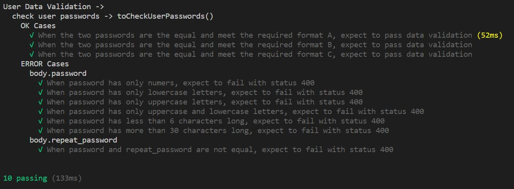
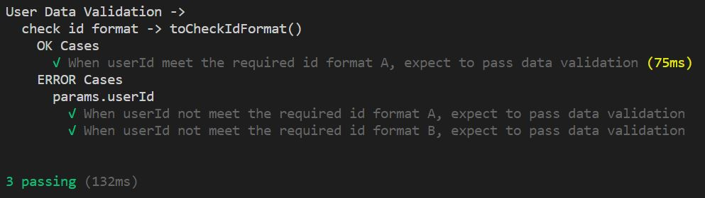

# rest_api_oop_typescript

todo

## Testing

### Unit testing

User data validation middleware - essential information

User data validation middleware - passwords

User data validation middleware - id format

### Integration testing

todo

### Test coverate

todo
